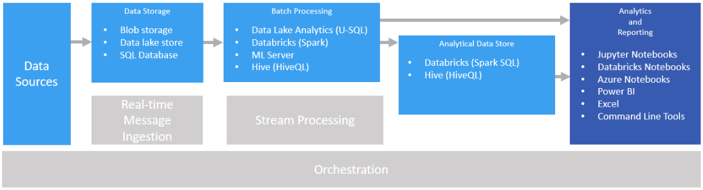

# Interactive data exploration

In many corporate business intelligence (BI) solutions, reports and semantic models are created by BI specialists and managed centrally. Increasingly, however, organizations want to enable users to make data-driven decisions. Additionally, a growing number of organizations are hiring *data scientists* or *data analysts*, whose job is to explore data interactively and apply statistical models and analytical techniques to find trends and patterns in the data. Interactive data exploration requires tools and platforms that provide low-latency processing for ad-hoc queries and data visualizations against data in a variety of schemas and sizes.

## Self-service BI

Self-service BI is a name given to a modern approach to business decision making in which users are empowered to find, explore, and share insights from data across the enterprise. To accomplish this, the data solution must support several requirements:

* Discovery of business data sources through a data catalog.
* Master data management to ensure consistency of data entity definitions and values.
* Interactive data modeling and visualization tools for business users.

In a self-service BI solution, business users typically find and consume data sources that are relevant to their particular area of the business, and use intuitive tools and productivity applications to define personal data models and reports that they can share with their colleagues.

Relevant Azure services:

- [Azure Data Catalog](/azure/data-catalog/data-catalog-what-is-data-catalog)
- [Microsoft Power BI](https://powerbi.microsoft.com/)

## Data exploration with notebooks
When an organization requires advanced analytics and predictive modeling, the initial preparation work is usually undertaken by specialist data scientists. A data scientist explores the data and applies statistical analytical techniques to find relationships between data *features* and the desired predicted *labels*. Data exploration is typically done using programming languages such as Python or R that natively support statistical modeling and visualization. The scripts used to explore the data are typically hosted in interactive, web based environments called notebooks such as Jupyter Notebooks, Databricks Notebooks or Azure Notebooks. These tools enable data scientists to explore the data programmatically while documenting and sharing the insights they find.

Relevant Azure services:

- [Azure Databricks Notebooks](https://docs.azuredatabricks.net/user-guide/notebooks/index.html)
- [Azure Notebooks](https://notebooks.azure.com/)
- [Jupyter Notebooks in The Data Science Virtual Machine](/azure/machine-learning/data-science-virtual-machine/linux-dsvm-walkthrough#jupyterhub)

## Challenges

- **Data privacy and compliance.** You need to be careful about making personal or sensitive data available to users for self-service analysis and reporting. There are likely to be compliance considerations, due to organizational policies and also regulatory issues. 

- **Data volume.** While it may be useful to give users access to the full data source, it can result in very long-running Excel or Power BI operations, or Spark SQL queries that use a lot of cluster resources.

- **User knowledge.** Users create their own queries and aggregations in order to inform business decisions. Are you confident that users have the necessary analytical and querying skills to get accurate results?

- **Sharing results.** There may be security considerations if users can create and share reports or data visualizations.

## Architecture

Although the goal of this scenario is to support interactive data analysis, the data cleansing, sampling, and structuring tasks involved in data science often include long-running processes. That makes a [batch processing](../big-data/batch-processing.md) architecture appropriate.

## Technology choices

The following technologies are recommended choices for interactive data exploration in Azure.

### Data storage

- **Azure Storage Blob Containers** or **Azure Data Lake Store**. Data scientists generally work with raw source data, to ensure they have access to all possible features, outliers, and errors in the data. In a big data scenario, this data usually takes the form of files in a data store.

For more information, see [Data storage](../technology-choices/data-storage.md).

### Batch processing

- **ML Server** or **Spark on Azure Databricks**. Most data scientists use programming languages with strong support for mathematical and statistical packages, such as R or Python. When working with large volumes of data, you can reduce latency by using platforms that enable these languages to use distributed processing. ML Server can be used on its own or in conjunction with Spark to scale out processing functions Spark running in Azure Databricks natively supports both R and Python for similar scale-out capabilities.
- **Hive on HDInsight**. Hive is a good choice for transforming data using SQL-like semantics. Users can create and load tables using HiveQL statements, which are semantically similar to SQL.

For more information, see [Batch processing](../technology-choices/batch-processing.md).

### Analytical Data Store

- **Spark SQL on Azure Databricks**. Spark SQL is an API built on Spark that supports the creation of dataframes and tables that can be queried using SQL syntax. Regardless of whether the data files to be analyzed are raw source files or new files that have been cleaned and prepared by a batch process, users can define Spark SQL tables on them for further querying an analysis. 
- **Hive on HDInsight**. In addition to batch processing raw data by using Hive, you can create a Hive database that contains Hive tables and views based on the folders where the data is stored, enabling interactive queries for analysis and reporting. HDInsight includes an Interactive Hive cluster type that uses in-memory caching to reduce Hive query response times. Users who are comfortable with SQL-like syntax can use Interactive Hive to explore data.

For more information, see [Analytical data stores](../technology-choices/analytical-data-stores.md).

### Analytics and reporting

- **Notebooks**. Jupyter Notebooks are available within Azure Notebooks as a managed notebook experience and are also available within the Data Science Virtual Machine. Azure Databaricks provides its own notebook experience optimized to deliver the best experience with Spark. Notebooks provide a browser-based interface for running code in languages such as R, Python, or Scala. When using ML Server or Spark to batch process data, or when using Spark SQL to define a schema of tables for querying, notebooks are a good choice for querying the data. When using Spark, you can use the standard Spark dataframe API or the Spark SQL API as well as embedded SQL statements to query the data and produce visualizations. Notebooks allow you to import modules and libraries from the community to aid you in your data exploration.  
- **Interactive Hive Clients**. If you use an Interactive Hive cluster to query the data, you can use the Hive view in the Ambari cluster dashboard, the Beeline command line tool, or any ODBC-based tool (using the Hive ODBC driver), such as Microsoft Excel or Power BI.

For more information, see [Data analytics and reporting technology](../technology-choices/analysis-visualizations-reporting.md).